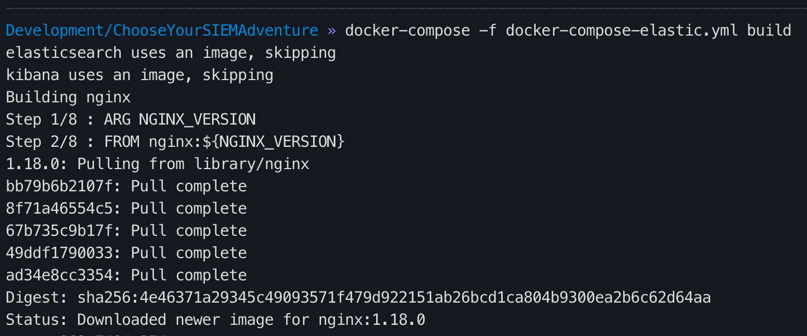
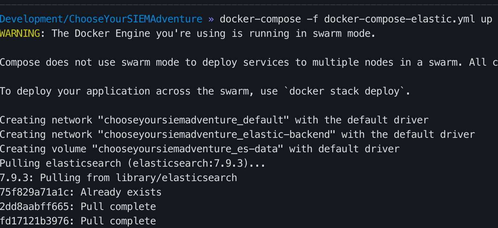

# Install/Setup Elastic

## Spin up with Docker
1. `vim .env` and set:
  1. `SIEM_PASSOWRD` - Set a password 
  1. `ELASTIC_VERSION` - If you would like a different version of Elastic set that here
1. `docker-compose -f docker-compose-elastic.yml build`
  1. 
1. `docker-compose -f docker-compose-elastic.yml up`
  1. 
1. Browse to `https://<Docker IP addr>:8443`
  1. Enter `elastic` for username
  1. Enter `<SIEM_PASSOWRD>` for password

## Spin up with Ansible

## References
* [CptOfEvilMinions/BlogProjects](https://github.com/CptOfEvilMinions/BlogProjects/tree/master/ElasticStackv7)
* [Dockerhub - Elasticsearch](https://hub.docker.com/_/elasticsearch)
* [Dockerhub - Logstash](https://hub.docker.com/_/logstash)
* [Dockerhub - Kibana](https://hub.docker.com/_/kibana)
* [Set Password and user with Docker-compose](https://discuss.elastic.co/t/set-password-and-user-with-docker-compose/225075/2)
* [We opened X-Pack](https://www.elastic.co/what-is/open-x-pack)
* [Install Kibana with Docker](https://www.elastic.co/guide/en/kibana/current/docker.html)
* [Configuring Security in Logstash](https://www.elastic.co/guide/en/logstash/current/ls-security.html)
* 
* 
* 
* 
