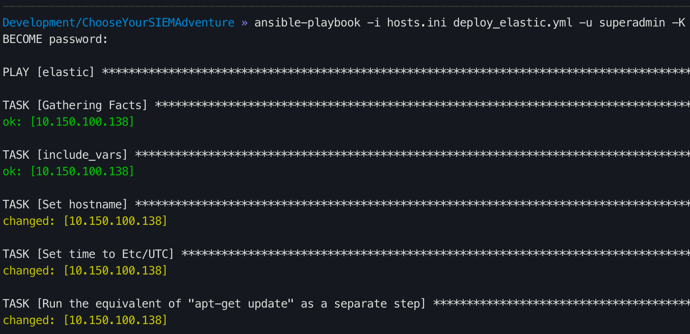
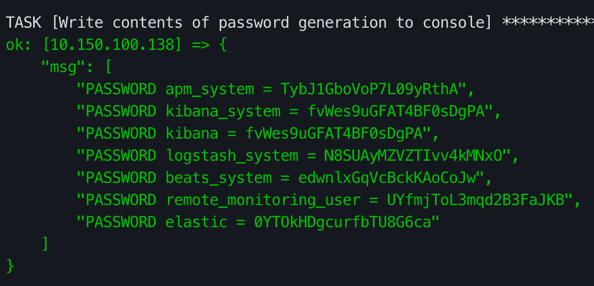
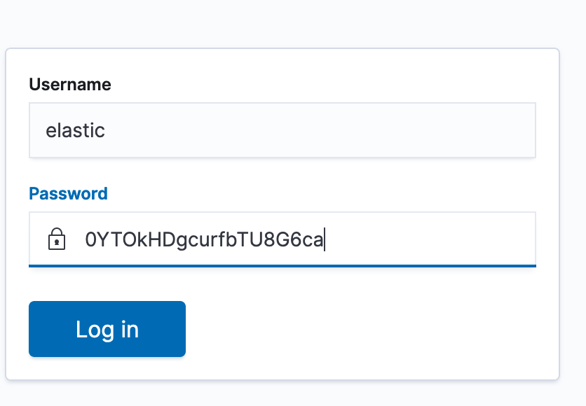

# Install/Setup Elastic

## Security notes
* Default password is set to `Changem123!`, see instructions in `docs/`
* Docker stacks are for development ONLY and are NOT secure for production

## Spin up with Docker
1. `vim .env` and set:
  1. `SIEM_PASSOWRD` - Set a password 
  1. `ELASTIC_VERSION` - If you would like a different version of Elastic set that here
1. `docker-compose -f docker-compose-elastic.yml build`
  1. 
1. `docker-compose -f docker-compose-elastic.yml up`
  1. 
1. Browse to `https://<Docker IP addr>:8443`
  1. Enter `elastic` for username
  1. Enter `<SIEM_PASSOWRD>` for password

## Spin up with Ansible
1. `ansible-playbook -i hosts.ini  deploy_elastic.yml -u superadmin -K`
  1. 
  1. 
  1. Copy password for `elastic` user OR `cat /tmp/elasticsearch-setup-passwords.txt`
1. Browse to `https://<IP addr>:443`
  1. Enter `elastic` for username
  1. Enter `<Password for elastic user from Ansible output>` for password
  1. 

## References
* [CptOfEvilMinions/BlogProjects](https://github.com/CptOfEvilMinions/BlogProjects/tree/master/ElasticStackv7)
* [Dockerhub - Elasticsearch](https://hub.docker.com/_/elasticsearch)
* [Dockerhub - Logstash](https://hub.docker.com/_/logstash)
* [Dockerhub - Kibana](https://hub.docker.com/_/kibana)
* [Set Password and user with Docker-compose](https://discuss.elastic.co/t/set-password-and-user-with-docker-compose/225075/2)
* [We opened X-Pack](https://www.elastic.co/what-is/open-x-pack)
* [Install Kibana with Docker](https://www.elastic.co/guide/en/kibana/current/docker.html)
* [Configuring Security in Logstash](https://www.elastic.co/guide/en/logstash/current/ls-security.html)
* [How to config Single node for Single Cluster (Standalone Cluster) ElasticSearch](https://stackoverflow.com/questions/16432300/how-to-config-single-node-for-single-cluster-standalone-cluster-elasticsearch)
* [Configure security in Kibanaedit](https://www.elastic.co/guide/en/kibana/current/using-kibana-with-security.html)
* [elasticsearch-setup-passwords](https://www.elastic.co/guide/en/elasticsearch/reference/current/setup-passwords.html)
* [How to setup password for elasticsearch users?](https://stackoverflow.com/questions/59644348/how-to-setup-password-for-elasticsearch-users)
* [Security settings in Elasticsearch](https://www.elastic.co/guide/en/elasticsearch/reference/current/security-settings.html)
* [Built-in users](https://www.elastic.co/guide/en/elasticsearch/reference/current/built-in-users.html)
* 
* 
* 
* 
* 
